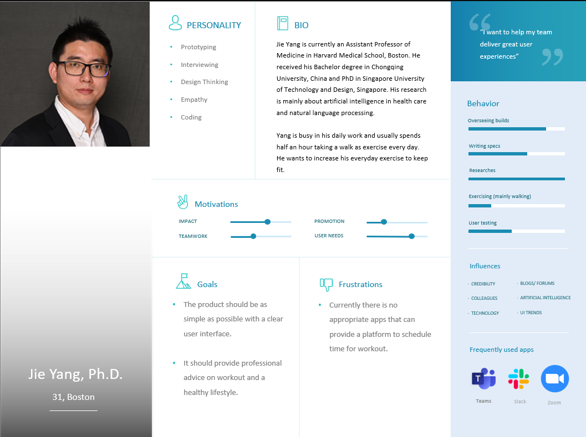

# Agile Harvard - Flex Fit Team
## Roles
| Name          | Role |
| ------------- | ------------- |
| Sergio Scattone | Developer / Scrum Master  |
| Marco Vazquez   | Product Owner  |
| Ziyuan Li | Developer  |
| Zhang Xingjian | Developer  |
## APP URL
https://octopus-app-h8uaj.ondigitalocean.app/
## Slack Channel
https://agilesoftwarecourse.slack.com/archives/C07AEDC601G
## Project Vision
Create an easy to use app that provides workout plans for users.
## Far Vision
Provide personalized fitness plans worldwide.
## Near Vision
Provide customisable workout plans to Universities.
## Stakeholders
| Stakeholder          | Description |
| ------------- | ------------- |
| Students learning to workout | Students at Harvard that may want to exercise during their studies |
| Professors trying to stay healthy  | Professors at Harvard that want to regularly exercise |
| Non-university people trying to lose weight | Older aged Boston locals trying to improve their health |
## Stakeholder Persona: Jie Yang

## Scrum management:
Link to Miro board: https://miro.com/app/board/uXjVK3fDWVI=/

# First sprint
## First backlog refinement: (whole-team relative-size estimating activity)
| User Story	| Sergio estimation	| Ziyuan Li estimation	| Zhang Xingjian	| Final estimation |
| ------------- | ------------- | ------------- | ------------- | ------------- |
| Show exercieses	| 5	| 3	| 8	| 5 |
| Show example workouts	5	| 5	| 8 |	5 |
| Show created workouts	2	| 3	| 3	| 3 |
| Improve user interface	| 2	| 3	| 3	| 3 |
| Show history of exercises	| 3	| 2 |	2 |	3 |
| Repeat previous exercises	| 3	| 2	| 3	| 3 |
| Show exercises for frequent users	| 5 | 3	| 3	| 3 |
| Show exercises for older people	| 3	| 2	| 2	| 3 |
| Store my habits	| 5	| 3	| 3	| 3 |
| Organize my exercise	| 5	| 3	| 3	| 3 |
| Sharing my exercises	| 2	| 2	| 2	| 2 |
| Show videos of excercises	| 3	| 2	| 2	| 2 |

## Estimated Velocity
5
## Reasone of estimation
- Sergio: It's our first sprint
- Ziyuan: We don't have strong development experts in the team
- Xingjian: We don't have data to compare with
- Xingjian: It's a new team
- Sergio: Week has a holiday

## Burdown link
https://docs.google.com/spreadsheets/d/1jOZ38mANGoOLkpzMHCnREkxw2VdNjMLCFFSqwA6GPnE/edit?gid=0#gid=0

## First Sprint: Standup Meeting - Wed 3 (third day of sprint)
| Name          | What have you done so far | What you plan to do today | Any Blockers |
| ------------- | ------------- | ------------- | ------------- |
| Sergio | Created digital ocean environment with a flash running env pulled from github | create a set of test and maybe create the sqlite db schema | short amount of time |
| Ziyuan | Research on Python Flask, ready for writing test cases for our product | Has written several test cases, then pass them successfully |
| Xingjian | I learned about flask and tried to built some simple projects on my own | Try to be familiar with the code further and try to write test cases |
| Marco | looked up how to use python flask to create a backend and simple html website | I am planning on adding basic unit tests today and a second page with a list of exercises |

## Evidence of Pair Programming

## TDD: Set of unit test attached to CI in Digital Ocean
[Test File](tests/test_app.py)

## Sprint review - Feedback from Stakeholder

### Translated:
"It is recommended to enrich the content, increase the graphical interface, and improve user friendliness."

## Sprint Retrospective:
| Name          | What went well | What went wrong | Action Items |
| ------------- | ------------- | ------------- | ------------- |
| Sergio | Even though our team didn't have a lot of experience in web development we were able to create a MVP | Implementing DB usage was more complicated than we have originally thought | Next sprint we can take DB management first to reduce risks |
| Ziyuan | Following what we have planed goes very well, we finish almost all as the backlog; Very strong cooperation, everyone contributes to different parts, even if something is hard for someone | ⁠The research or preparation of the project did not be done so wel | ⁠More detail as the feedback said |
| Marcp | I agree with Ziyan's comment on cooperation. I think having a Whatsapp for quick communication and slack for code sharing was helpful. | I could have probably setup a schedule from the first day so we wouldn't scramble for last minute plans. | I think we should hold sprint planning earlier and establish tasks for everyone faster. |
| Xingjian | we have created the basic page and the database for the website and we have managed to use all these tools very well | we spent too much time planning and we didn’t make a good UI  | learn more relevant skills and design a good UI |
