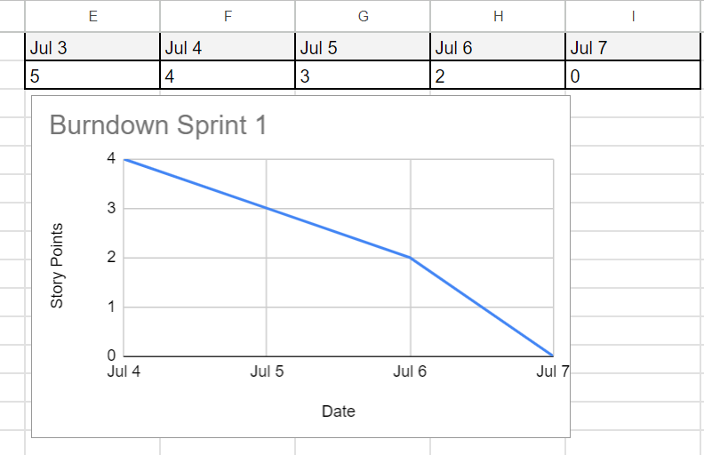
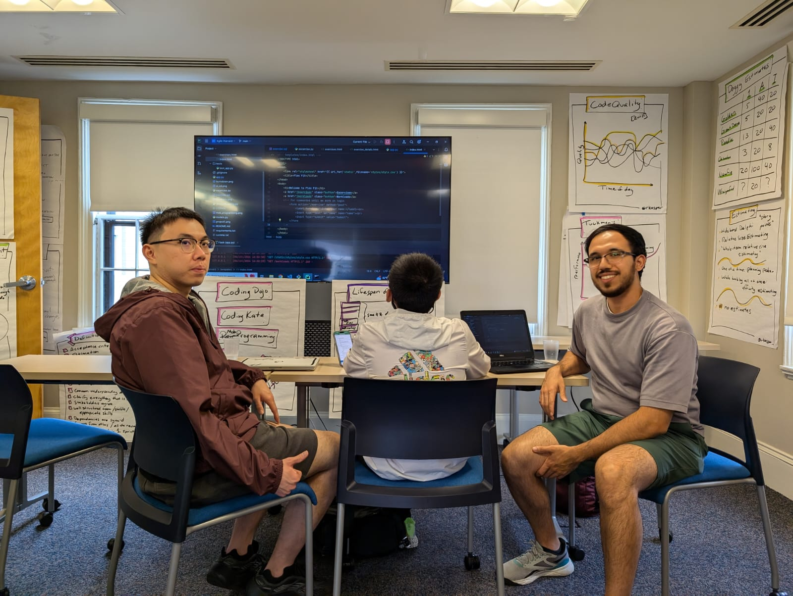
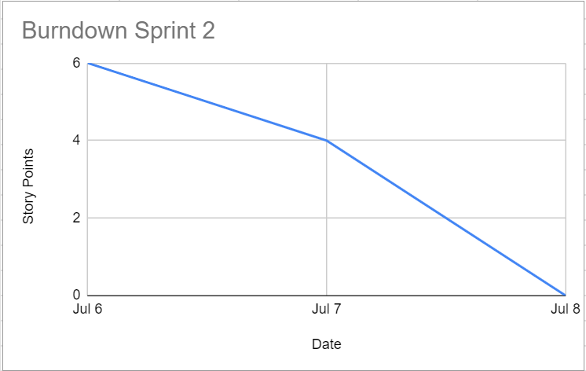
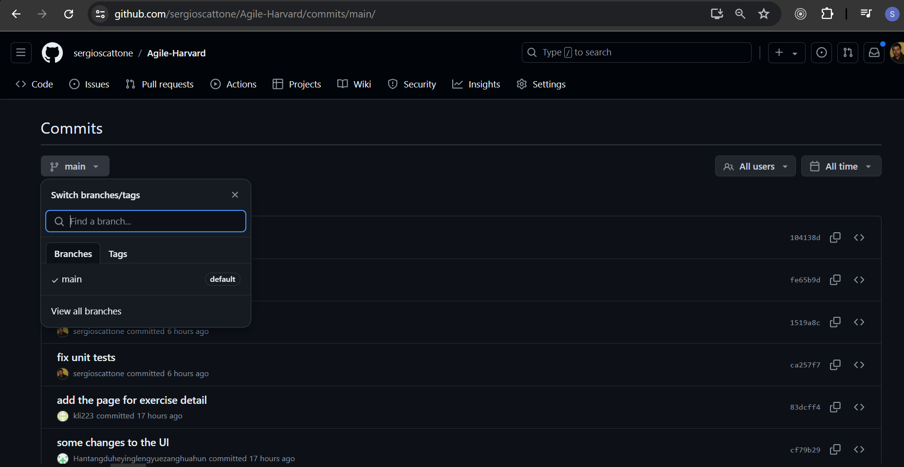
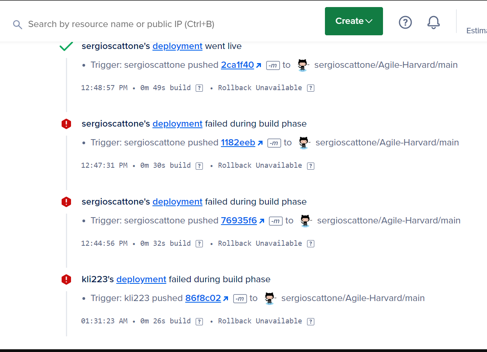

# Agile Harvard - Flex Fit Team
## Roles
| Name          | Role |
| ------------- | ------------- |
| Sergio Scattone | Developer / Scrum Master  |
| Marco Vazquez   | Developer / Product Owner  |
| Ziyuan Li | Developer  |
| Zhang Xingjian | Developer  |
## APP URL
https://octopus-app-h8uaj.ondigitalocean.app/
## Slack Channel
https://agilesoftwarecourse.slack.com/archives/C07AEDC601G
## Jira Board
https://flex-fit.atlassian.net/jira/software/projects/FFA/boards/2
## Project Vision
Create an easy to use app that provides workout plans for users.
## Far Vision
Improve fitness and health worldwide.
## Near Vision
Provide customisable workout plans to Universities.
## Stakeholders
| Stakeholder          | Description |
| ------------- | ------------- |
| Students learning to workout | Students at Harvard that may want to exercise during their studies |
| Professors trying to stay healthy  | Professors at Harvard that want to regularly exercise |
| Non-university people trying to lose weight | Older aged Boston locals trying to improve their health |
## Stakeholder Persona: Jie Yang

## Scrum management:
Link to Miro board: https://miro.com/app/board/uXjVK3fDWVI=/

# First sprint
## First backlog refinement: (whole-team relative-size estimating activity)
| User Story	| Sergio estimation	| Ziyuan Li estimation	| Zhang Xingjian	| Final estimation |
| ------------- | ------------- | ------------- | ------------- | ------------- |
| Show exercieses	| 5	| 3	| 8	| 5 |
| Show example workouts	| 5	| 5	| 8 |	5 |
| Show created workouts	| 2	| 3	| 3	| 3 |
| Improve user interface	| 2	| 3	| 3	| 3 |
| Show history of exercises	| 3	| 2 |	2 |	3 |
| Repeat previous exercises	| 3	| 2	| 3	| 3 |
| Show exercises for frequent users	| 5 | 3	| 3	| 3 |
| Show exercises for older people	| 3	| 2	| 2	| 3 |
| Store my habits	| 5	| 3	| 3	| 3 |
| Organize my exercise	| 5	| 3	| 3	| 3 |
| Sharing my exercises	| 2	| 2	| 2	| 2 |
| Show videos of exercises	| 3	| 2	| 2	| 2 |

## Estimated Velocity
5
## Reasone of estimation
- Sergio: It's our first sprint
- Ziyuan: We don't have strong development experts in the team
- Xingjian: We don't have data to compare with
- Xingjian: It's a new team
- Sergio: Week has a holiday

## Burndown Chart

## Burndown link
https://docs.google.com/spreadsheets/d/1jOZ38mANGoOLkpzMHCnREkxw2VdNjMLCFFSqwA6GPnE/edit?gid=0#gid=0

## First Sprint: Standup Meeting - Wed 3 (third day of sprint)
| Name          | What have you done so far | What you plan to do today | Any Blockers |
| ------------- | ------------- | ------------- | ------------- |
| Sergio | Created digital ocean environment with a flash running env pulled from github | create a set of test and maybe create the sqlite db schema | short amount of time |
| Ziyuan | Research on Python Flask, ready for writing test cases for our product | Has written several test cases, then pass them successfully | Low Familiarity of programming |
| Xingjian | I learned about flask and tried to built some simple projects on my own | Try to be familiar with the code further and try to write test cases |
| Marco | looked up how to use python flask to create a backend and simple html website | I am planning on adding basic unit tests today and a second page with a list of exercises | sprint is during holiday, so might have to only focus on critical tasks |

## Ideas about how to deal with impediments
We have decided to focus on core aspects of the application given there is a holiday during the sprint.
Also we are using pre and post class time to have meetings and do mob programming.

## Evidence of Pair Programming

## TDD: Set of unit test attached to CI in Digital Ocean
[Test File](unit_tests.py)

## Sprint review - Feedback from Stakeholder

### Translated:
"It is recommended to enrich the content, increase the graphical interface, and improve user friendliness."

## Sprint Retrospective:
| Name          | What went well | What went wrong | Action Items |
| ------------- | ------------- | ------------- | ------------- |
| Sergio | Even though our team didn't have a lot of experience in web development we were able to create a MVP | Implementing DB usage was more complicated than we have originally thought | Next sprint we can take DB management first to reduce risks |
| Ziyuan | Following what we have planed goes very well, we finish almost all as the backlog; Very strong cooperation, everyone contributes to different parts, even if something is hard for someone | ⁠The research or preparation of the project did not be done so wel | ⁠More detail as the feedback said |
| Marco | I agree with Ziyan's comment on cooperation. I think having a Whatsapp for quick communication and slack for code sharing was helpful. | I could have probably setup a schedule from the first day so we wouldn't scramble for last minute plans. | I think we should hold sprint planning earlier and establish tasks for everyone faster. |
| Xingjian | we have created the basic page and the database for the website and we have managed to use all these tools very well | we spent too much time planning and we didn’t make a good UI  | learn more relevant skills and design a good UI |

# Second Sprint
## Forcast for this sprint
10 story points
## Rationale
Last sprint we completed 5, now we have many tools and practice settled, like the use of jira for user stories, tasks and communication, we are used to regular scrum meetings.
This means we will focus more in coding; also it is weekend and we will have the time that we regularly use to attend the course.

## Sprint Backlog - Sprint Planning
We have re-configured the priority of our stories to give priority to imporve the UI that was the feedback that we have received from our stakeholder.
On the other hand, since we received a bad grade about the test that we needed to do for the second assignment, we have put a story to fix the old test and create the new ones that are required for next assignment. This is not an ask of any of our stakholders but is a task that we need to do and takes resources from our team, so we have put the professor as stakholder for this matter: https://flex-fit.atlassian.net/browse/FFA-18.

## Standup Meeting - Saturday 6 (second day of sprint)
| Name          | What have you done so far | What you plan to do today | Any Blockers |
| ------------- | ------------- | ------------- | ------------- |
| Sergio | I worked on fixing unit test, and CI/CD jobs on digital ocean, I created a new test file, with a sample of tests for exercises, workloads and users |  I plan to continue adding basic unit tests to meet the 20 ones we need for next assignment on Monday | I had to put the file in the root of the project because it seems that my environment has some issues importing the modules when they are not in the same folder |
| Ziyuan | I have do bunch of reseaches on the imrpoving user interface, and try to know more and more deeply about the mmechanism of how python and css works together| Improving the interface of 'Login'and 'Exercise' pages | Some blockers about the unfamiliarity |
| Xingjian |  |  |
| Marco | I helped on fixing and adding some unit tests in pair programming | I am going to add the workout examples page | no blockers |

### What are the impediments? What is your impediment removal plan?
Put the test file in the root of the folder, as well as the classes for exercises, workloads and users. We can move them later when we figure what's the issue and for now focus on MVP

### what did you do in the last 24 hours that helped you meet the Sprint Goal?
We have improved the UI with CSS and fade effects according to the feedback that we received from the stakholder.
We have worked heavely in fixing unit tests to be aligned with our sprint goal. 

## Evidence of mob - pair programming

## Burndown for second sprint

## Sprint review - Feedback from Stakeholder

### Translated:
"It is recommended to enrich the content, increase the graphical interface, and improve user friendliness."

## Continuous Delivery
We have only one main branch where we all push:

## Continuous Integration
we have our Continuous Delivery system that builds our application automagically whenever the build is "green" (when test passes) and if the test do not pass (red) it does not push that broken build to prod: https://octopus-app-h8uaj.ondigitalocean.app/

## Sprint Retrospective:
| Name          | What went well | What went wrong | Action Items |
| ------------- | ------------- | ------------- | ------------- |
| Sergio |  |  |  |
| Ziyuan |  |  |  |
| Marco |  |  |  |
| Xingjian |  |   |  |
